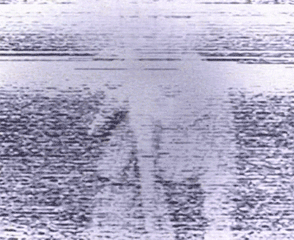
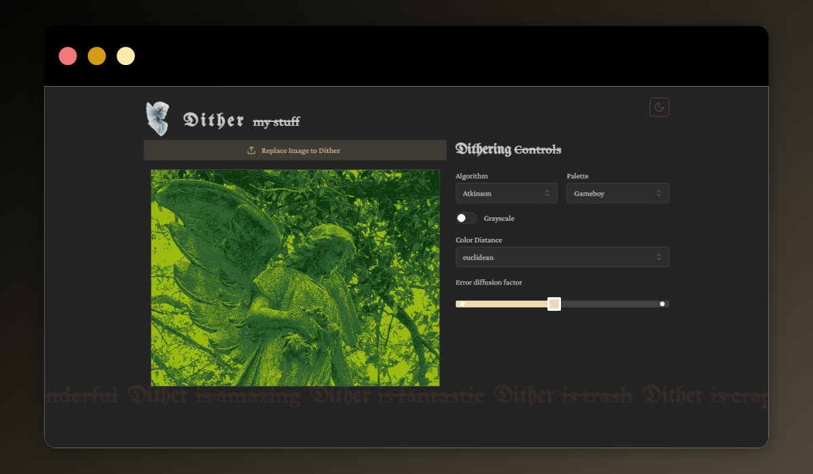

<p align="center">
  
</p>

<h1 align="center">Dither my stuff</h1>

<p align="center">
  <strong>Glitch your images with style.</strong><br />
  A playground to experiment with dithering effects, color palettes, and pixel aesthetics — all in real time.
</p>

<p align="center">
  <a href="https://dither-my-stuff.vercel.app/" target="_blank"><strong>▶ Try it live</strong></a> •
  <a href="https://github.com/luismtns/dither-my-stuff/issues">Report an Issue</a> •
  <a href="#-contributing">Contribute</a>
</p>

---

## ✨ What is this?

**Dither my stuff** is a creative tool for artists, developers, and nostalgic pixel lovers who want to apply dithering effects to their images.
Built for fun, experimentation, and aesthetics.



---

## 🎨 Features

- ✅ Upload any image
- 🎚️ Choose between classic dithering algorithms
- 🎨 Pick from curated palettes (GameBoy, Sepia, Cyberpunk...)
- 🧪 Add your own palette (hex colors)
- 🔥 Toggle grayscale mode
- 🧠 Control color distance metrics
- 🔧 Algorithm-specific tweaks (diffusion, scaling, etc.)
- 📀 Export the final image exactly as previewed

---

## 🚀 Tech Stack

Built using:

- [React 18](https://reactjs.org/)
- [Vite](https://vitejs.dev/)
- [TypeScript](https://www.typescriptlang.org/)
- [Mantine UI](https://mantine.dev/)
- [Canvas API](https://developer.mozilla.org/en-US/docs/Web/API/Canvas_API)

---

## 📦 Getting Started

### 1. Clone the repository

```bash
git clone https://github.com/luismtns/dither-my-stuff.git
cd dither-my-stuff
```

### 2. Install dependencies

```bash
yarn
```

### 3. Start development server

```bash
yarn dev
```

Then open [`http://localhost:5173`](http://localhost:5173) in your browser.

---

## 🛠 Available Scripts

```bash
yarn dev        # Start local development
yarn build      # Build for production
yarn preview    # Preview production build
yarn lint       # Run ESLint & Prettier
```

---

## 📁 Project Structure

```bash
src/
├── assets/            # Logo, presets, and media
├── components/        # UI components (Canvas, Controls, etc.)
├── hooks/             # Custom hooks
├── features/dither/   # Algorithms, palettes, core logic
├── utils/             # Helper functions
├── App.tsx            # Main application
└── main.tsx           # Entry point
```

---

## 🌐 Deployment

This project is deployed on [Vercel](https://vercel.com/)
🔗 [https://dither-my-stuff.vercel.app](https://dither-my-stuff.vercel.app)

---

## 💡 Inspiration

Inspired by retro filters, lo-fi art, TikTok & Instagram aesthetics, and tools like [Photomosh](https://photomosh.com/).

---

## 🤝 Contributing

Contributions are super welcome!

1. Fork the project
2. Create a new branch: `git checkout -b feature/my-feature`
3. Make your changes
4. Commit: `git commit -m "feat: added my feature"`
5. Push: `git push origin feature/my-feature`
6. Open a pull request 🙌

Need help? Open an issue!

---

## 📄 License

This project is licensed under the MIT License.
See the [LICENSE](./LICENSE) file for more info.

---

## 💚 Made with pixel love by

**[Luís Otávio Bovo](https://luisbovo.com.br)**
[Website](https://luisbovo.com.br) · [GitHub](https://github.com/luismtns)

<p align="center">
  
</p>
